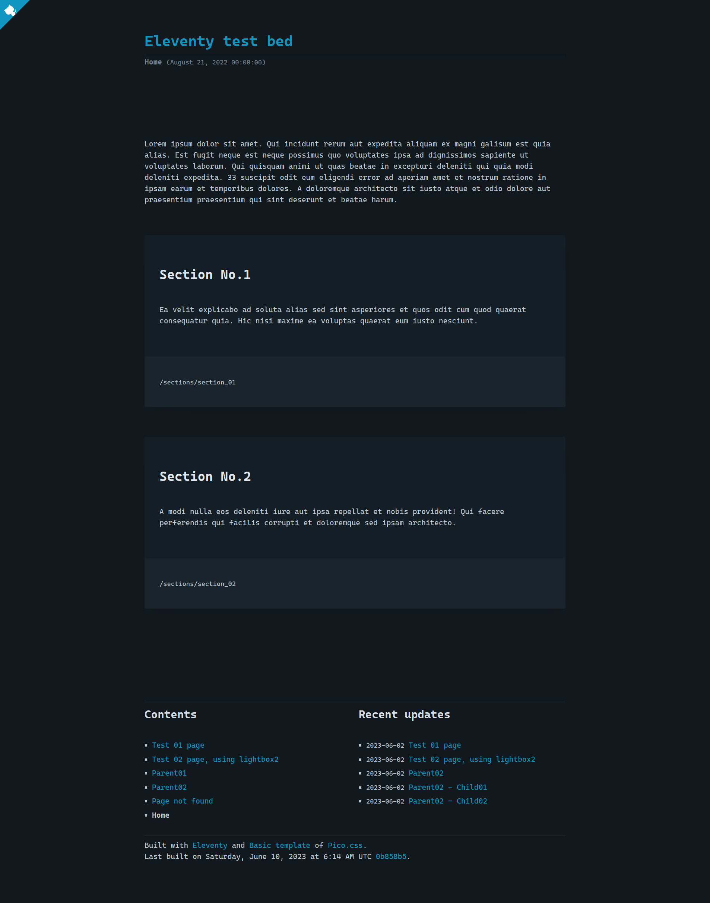

# Eleventy-test-bed

## What is this ?

[Demo site (Eleventy test bed)](https://eleventy-test-bed-dollplayer2501.netlify.app/)

> **Note**  
> __2023-12-05, JST__  
> There are problems in using [Lightbox2](https://lokeshdhakar.com/projects/lightbox2/) with the combination of [Pico.css](https://www.npmjs.com/package/@picocss/pico) **v1.5.10**, the latest version at the moment, and **v2.11.4**, the latest version of [lightbox2](https://www.npmjs.com/package/lightbox2).  
> To avoid this, I have fixed the combination of versions below.  
>
> - [Pico.css](https://www.npmjs.com/package/@picocss/pico) v1.5.10
> - **[Lightbox2 v2.11.3](https://www.npmjs.com/package/lightbox2/v/2.11.3)**
>
> With my skills, I don't know how to get around this.

## Getting started

    git clone git@github.com:dollplayer2501/Eleventy-test-bed.gitt any-path-name
    cd any-path-name

    # Check and set your Node.js version, for example in my case
    rtx activate fish | source

    # Installing NPM packages
    npm install

    #
    # 1. Local
    #   Data is stored in ./any-path-name/_develop
    #
    npm run develop:watch
    # http://localhost:8080

    # 2. Production
    #   Data is stored in ./any-path-name/_product
    #   HTML is compressed
    #
    npm run product:build
    # If you want to check production's data
    npm run product:serve
    # http://localhost:3000

## The concept of sorting articles that I implemented

- Articles are sorted by the program internally without using Eleventy's tag, navigation plug-ins, file dates or `date`.
- At a minimum, `order` should be aligned at the same level and|or same path.
- You can understand the behavior by comparing the *.md file in `./source/contents/` that I store with the generated HTML file.
- The implementation is implemented in `./source/_config/eleventy.filters.js` as a Filter for Eleventy.
- This idea and implementation may be an act that eliminates the benefits of Eleventy, but I don't know.

|Path & file name|URL|Order|In-program sort order|
|:---|:---|---:|:---|
|`/home.md`|`/index.html`|50|`__50`|
|`/404.md`|`/404.html`|40|`__40`|
|`/test01.md`|`/test01/index.html`|11|`__11`|
|~~`/test02.md`~~|~~`/test02.html`~~ This pattern is not allowed. **`/foo/..../bar/index.html`** is allowed. **`/foo/..../bar.html`** is not allowed|~~12~~|~~`__12`~~|
|`/parent01/index.md`|`/parent01/index.html`|20|`__20`|
|`/parent01/child01/index.md`|`/parent01/child01/index.html`|1|`__20___1`|
|`/parent01/child01/grandchild01.md`|`/parent01/child01/grandchild01/index.html`|100|`__20___2_100`|
|`/parent01/child01/grandchild02.md`|`/parent01/child01/grandchild02/index.html`|200|`__20___2_200`|
|`/parent01/child02/index.md`|`/parent01/child02/index.html`|2|`__20___2`|
|`/parent01/child02/grandchild01/index.md`|`/parent01/child02/grandchild01/index.html`|1|`__20___2___1`|
|`/parent01/child02/grandchild02/index.md`|`/parent01/child02/grandchild02/index.html`|2|`__20___2___2`|
|`/parent01/child03/index.md`|`/parent01/child03/index.html`|3|`__20___3`|
|`/parent02/index.md`|`/parent02/index.html`|30|`__30`|
|`/parent02/child01.md`|`/parent02/child01/index.html`|1|`__30___1`|
|`/parent02/child02.md`|`/parent02/child02/index.html`|2|`__30___2`|

- Path & file name  
Path and file name stored on the local PC
- URL  
`URL` described in *.md file
- Order  
This system-specific sort order that Eleventy does not have. Describe in *.md file.
- In-program sort order  
Eleventy's Filter feature decomposes paths and file names to create your own sort string.
Character string sorting is performed using this character string as a key.
Inside the program, sprintf-js is used instead of "_", and spaces are used, which is 12 digits.

## Real intention

I wanted to see how Eleventy's navigation and image plugins behave. So I was building the minimal Eleventy I needed. In the meantime, I thought it would be interesting to make this publicly available.  
This is the real intention.

There is a discrepancy in the implementation, I made this after building the following site, but for reference, the following URL is the site using Eleventy that I operate.

- Site URL: [unlimited text works, the 4th.](https://dollplayer2501.netlify.app/)
- Source code: [dollplayer2501/Eleventy-netlify-V2: Eleventy with Laravel Mix, Gulp](https://github.com/dollplayer2501/Eleventy-netlify-V2)

//
